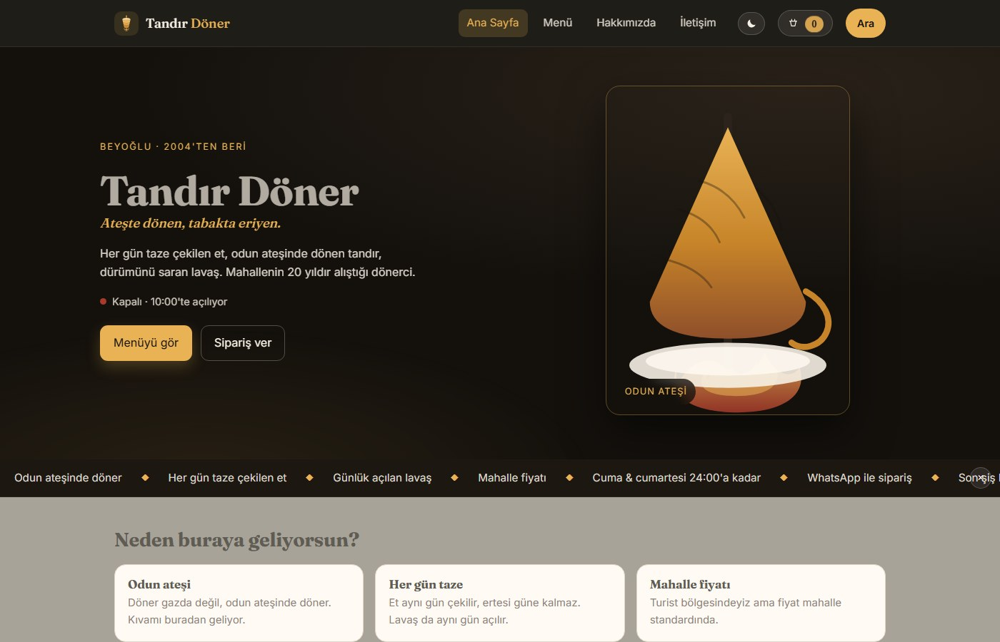

# 🌗 Tandır Döner — Döner Dükkanı Websitesi

[](#özellikler)


[](#tasarım-sistemi)
[](#sipariş-akışı)

Mahalle dönercisi için **sıfır bağımlılıklı, build adımı olmayan** tanıtım + menü sitesi.
Dosyaları tarayıcıya sür, çalışır. Menü ürünlerini değiştirmek için programlama bilmesine gerek yok —
her şey `site.js` içindeki iki veri bloğunda.



---

## İçindekiler

- [Özellikler](#özellikler)
- [Proje yapısı](#proje-yapısı)
- [Nasıl çalıştırılır](#nasıl-çalıştırılır)
- [İçerik yönetimi](#içerik-yönetimi)
- [Sipariş akışı](#sipariş-akışı)
- [Tasarım sistemi](#tasarım-sistemi)
- [SEO & erişilebilirlik](#seo--erişilebilirlik)
- [Yayına alma](#yayına-alma)
- [Kendi dükkanına uyarlama checklist'i](#kendi-dükkanına-uyarlama-checklisti)
- [Sık sorulanlar / sorun giderme](#sık-sorulanlar--sorun-giderme)
- [Yol haritası](#yol-haritası)
- [Katkı & commit kuralları](#katkı--commit-kuralları)

---

## Özellikler

| Özellik | Açıklama |
|---|---|
| **4 sayfa** | Ana sayfa, Menü, Hakkımızda, İletişim |
| **Menü arama** | Ürün adı + açıklamada anlık filtre (sayfa yenilemeden) |
| **Sipariş sepeti** | Sağ altta canlı sepet, adet artır/azalt, toplam tutar, `localStorage` ile kalıcılık |
| **WhatsApp sipariş** | Sepeti tek tıkla `wa.me` üzerinden hazır mesaj olarak gönderir |
| **Açık / kapalı rozeti** | Saatlerden otomatik hesaplanır, yeşil/kırmızı nokta ile gösterilir |
| **Mobil uyumlu** | 640 px altında hamburger menü, sepet tam genişlik, hero tek kolon |
| **Animasyon** | Scroll-reveal, ken burns, köz parçacıkları, kayan şerit, sayan sayaçlar, toast bildirimi |
| **SEO** | Sayfa başlıkları, meta description, `schema.org` `Restaurant` JSON-LD (adres + telefon) |
| **Erişilebilirlik** | `aria-label`, `aria-expanded`, `prefers-reduced-motion`, klavye odaklanma (focus outline) |
| **Gece modu** | Üst bardaki ☾/☀ düğmesi; tercih `localStorage`'da durur, seçilmezse sistem ayarı (`prefers-color-scheme`) esas alınır |
| **Kısa URL dostu** | Build yok, framework yok → CDN'de ~30 KB HTML/CSS/JS + SVG |
| **Türkçe para formatı** | `285` yaz, `285 ₺` olarak çıkar (`toLocaleString("tr-TR")`) |

---

## Proje yapısı

```
doner-website/
├── index.html          # Hero, "neden buraya geliyorsun", vitrin menüsü, saatler
├── menu.html           # Tüm menü + arama kutusu + sepet
├── about.html          # Hikâye, üretim tarzı
├── contact.html        # Adres, telefon, WhatsApp, harita iframe, saatler
├── styles.css          # Tek tasarım dosyası (renk paleti :root içinde)
├── site.js             # TÜM İÇERİK VERİSİ: SITE + MENU, sepet & render mantığı
├── assets/
│   ├── logo.svg           # Üst bar logosu: tandır + şiş + köz (64×64 viewBox)
│   ├── favicon.svg        # Sekme simgesi: koyu rozet içinde aynı işaret
│   ├── doner.svg          # Eski SVG illüstrasyon (yedek, kullanımda değil)
│   └── doner-photo.jpg    # Gerçek tandır döner fotoğrafı (640×1137, ~172 KB)
├── docs/
│   └── preview.jpg        # README ekran görüntüsü
├── README.md
└── .gitignore
```

> **Kural:** İçerik `site.js`'te, tasarım `styles.css`'te, iskelet `*.html`'de.
> Ürün/fiyat/saat değiştirmek için sadece `site.js`'e dokunman yeterli.

---

## Nasıl çalıştırılır

Build yok, paket yok. İstediğinden birini seç:

```bash
# 1) Yerel sunucu (önerilen)
python3 -m http.server 8000      # http://localhost:8000

# 2) Node varsa
npx serve .

# 3) En basit: index.html'i çift tıklayıp tarayıcıda aç
```

> Not: `file://` ile açarsan harita iframe'i ve bazı tarayıcı özellikleri çalışmayabilir;
> yayına alırken mutlaka bir HTTP sunucusu kullan.

---

## İçerik yönetimi

### 1) Dükkan bilgileri — `SITE`

```js
const SITE = {
  name:      "Tandır Döner",
  slogan:    "Ateşte dönen, tabakta eriyen.",
  intro:     "Her gün taze çekilen et, odun ateşinde dönen tandır…",
  phone:     "+90 532 123 45 67",
  phoneHref: "tel:+905321234567",
  whatsapp:  "905321234567",          // ülke kodlu, boşluksuz
  address:   "İstiklal Caddesi No: 12, Beyoğlu / İstanbul",
  mapsQuery: "İstiklal Caddesi 12 Beyoğlu İstanbul",
  instagram: "https://instagram.com/",
  email:     "info@tandirdoner.com",
  hours: [
    { day: "Pazartesi", open: "10:00", close: "23:00" },
    // … Pazar'a kadar 7 satır
  ],
};
```

Sayfalarda `data-site="phone"` gibi attribute'lar bu nesneden otomatik doldurulur —
yani telefon numarasını bir kez değiştirince **tüm sayfalarda** güncellenir.

### 2) Menü — `MENU`

```js
const MENU = [
  {
    category: "Dönerler",
    note: "Tüm dönerler lavaş dürüm veya porsiyon olarak gelir.",   // opsiyonel alt not
    items: [
      { name: "Tandır Dürüm", desc: "…", price: 285, tags: ["Çok satan"] },
      { name: "Yönüm Dürüm",  desc: "…", price: 260 },
    ],
  },
  // …
];
```

| Alan | Zorunlu | Not |
|---|---|---|
| `category` | ✅ | Kategori başlığı (amber çizgili) |
| `note` | ❌ | Kategori altına küçük gri not |
| `name` | ✅ | Ürün adı |
| `desc` | ❌ | Açıklama (aramada da aranır) |
| `price` | ✅ | Sayı; `₺` otomatik eklenir |
| `tags` | ❌ | İlk etiket amber, diğerleri yeşil görünür |

**Menü şablonu (mevcut 6 kategori, 42 ürün):**

| Kategori | Ürün sayısı | Örnek fiyat aralığı |
|---|---|---|
| Dönerler | 10 | 175 – 420 ₺ |
| Fırından | 4 | 165 – 330 ₺ |
| Başlangıçlar | 7 | 90 – 135 ₺ |
| Yanında İyi Gider | 7 | 40 – 150 ₺ |
| Tatlılar | 5 | 110 – 190 ₺ |
| İçecekler | 9 | 20 – 80 ₺ |

`tags` verilen ürünler ana sayfadaki **Vitrinden** bölümüne otomatik girir.

### 3) Kayan şerit — `SITE.ticker`

```js
ticker: ["Odun ateşinde döner", "Her gün taze çekilen et", "Cuma & cumartesi 24:00'a kadar", …]
```

Şeridin sağındaki **×** düğmesi onu kapatır; tercih `localStorage`'da
`tandir-ticker = "off"` olarak durur. Geri getirmek için o anahtarı sil.

### 4) Açılış saatleri

`SITE.hours` yedi günü Pazartesi → Pazar sırasıyla tutar. Sayfa bugünün satırını
`tr.is-today` ile vurgular ve "Bugün / gün / saat" kutusunu doldurur. Not satırları
("Son sipariş…", "Resmî tatiller…") `index.html` içinde düzenlenir.

---

## Sipariş akışı

```
Menüde "Sipariş" tıkla
        │
        ▼
  order[] dizisine eklenir (aynı ürün → adet artar)
        │
        ▼
  Sağ alttaki sepet paneli güncellenir (adet, toplam)
        │
        ▼
  "WhatsApp ile gönder" → wa.me/<numara>?text=<hazır mesaj>
```

Gönderilen mesaj formatı:

```
Tandır Döner sipariş:
2 × Tandır Dürüm — 570 ₺
1 × Ayran — 45 ₺
Toplam: 615 ₺
```

> Sepet **`localStorage`'da (`tandir-cart`) durur**: sayfa yenilense ya da başka sayfaya geçilseniz
> sepet korunur. "Sepeti temizle" düğmesi sıfırlar.

---

## Tasarım sistemi

Renkler `styles.css` → `:root` bloğunda tek yerde tanımlı:

| Token | Hex | Kullanım |
|---|---|---|
| `--ink` | `#171310` | Üst bar, footer, sepet paneli (kömür) |
| `--ink-2` | `#221b15` | Fiyat yazısı, koyu yüzeyler |
| `--ink-3` | `#2c241c` | Üçüncül yüzey |
| `--cream` | `#f6f0e4` | Sayfa arka planı |
| `--paper` | `#fffaf3` | Kartlar, menü satırları |
| `--amber` | `#e9b255` | Marka rengi: butonlar, vurgular, aktif nav |
| `--amber-deep` | `#c78429` | Hover, kategori çizgisi, ilk etiket |
| `--red` | `#a83a2c` | "Kapalı" durumu, uyarı |
| `--olive` | `#6b7a5b` | İkincil etiketler (Vejetaryen) |
| `--muted` | `#8d8478` | Açıklama metinleri, gri tonlar |
| `--line` | `#e2d7c6` | Kenarlıklar, ayırıcılar |

Tipografi: başlıklar `Fraunces` (serif), gövde `Inter` — Google Fonts'tan gelir,
internet yoksa `Georgia` / `system-ui`'ye düşer. Kırılma noktaları: **900 px** (iletişim/story tek kolon),
**860 px** (hero tek kolon), **640 px** (hamburger menü).

### Animasyonlar

| Animasyon | Nerede | Nasıl |
|---|---|---|
| **Scroll reveal** | Kartlar, story, vitrin, harita | `IntersectionObserver` → `.reveal.is-in`, `--d` ile kademeli gecikme |
| **Ken Burns** | Hero fotoğrafı | `kenburns` 22 s, sürekli ileri-geri zoom |
| **Köz parçacıkları** | Hero arka planı | `.embers i` — 5 amber nokta, farklı gecikmelerle yükselir |
| **Kayan şerit** | Hero altındaki ticker | `SITE.ticker` yazıları, `marquee` 34 s (hover'da 16 s), × ile kapatılabilir |
| **Sayaçlar** | İstatistik kartları | `data-count` / `data-suffix`, göründüğünde 0'dan sayılır |
| **Menü satırları** | Menü sayfası | Her satır `--d` index'iyle sırayla yükselir |
| **Sepet & toast** | Menü / vitrin | "Eklendi" rozeti, sağ altta sepet, sol altta bildirim |
| **Üst bar** | Tüm sayfalar | Scroll ilerleme çubuğu + `is-scrolled` koyulaşması |
| **Logo** | Üst bar | `sway` ile hafif salınım, hover'da yükselme |

> `prefers-reduced-motion: reduce` durumunda tüm animasyonlar kapanır,
> reveal öğleri görünür halde kalır.

### Görseller

| Dosya | Boyut | Ağırlık | Nerelerde |
|---|---|---|---|
| `assets/doner-photo.jpg` | 640 × 1137 | ~172 KB | Hero (320 px'e ölçeklenir), Hakkımızda (300 × 340 px kesim) |
| `assets/logo.svg` | 64 × 64 viewBox | ~1 KB | Tüm sayfalarda üst bar (32 px) |
| `assets/favicon.svg` | 64 × 64 | ~1 KB | Sekme / sekme simgesi (`rel="icon"`) |
| `assets/doner.svg` | 320 × 320 | 1.7 KB | Yedek illüstrasyon |

Fotoğraf progressive JPEG, mozjpeg, q75. Hero'da 320 CSS px gösterildiği için
2x DPR ekranlara yakın bir çözünürlük veriyor.

> ⚠️ **Lisans uyarısı:** bu görsel Yandex görsel aramasından alındı, dükkana ait
> değil. Gerçek yayına geçerken **kendi çektiğin fotoğraf** ile değiştir
> (`assets/doner-photo.jpg` üzerine aynı adla yaz, kod değişikliği gerekmez).


---

## SEO & erişilebilirlik

- `index.html` içinde `application/ld+json` ile **`schema.org/Restaurant`** yapılandırılmış verisi
  (isim, mutfak, telefon, adres) → Google'ın "yerel işletme" paneli için hazır.
- Her sayfada `lang="tr"`, `viewport`, sayfaya özel `<title>` ve `meta description`.
- Hamburger butonu `aria-expanded` durumunu takip ediyor.
- Arama inputu `type="search"` + `aria-label`.
- `prefers-reduced-motion: reduce` durumunda yumuşak kaydırma kapatılıyor.

**Yapılacak:** gerçek adres/telefon girildikten sonra JSON-LD'yi de güncellemeyi unutma
(şu an örnek veri yazılı).

---

## Yayına alma

Statik site → herhangi bir statik host çalışır. Build adımı olmadığı için hepsi
"dosyaları koy, çık" şeklinde:

### Vercel (en hızlı)
```bash
vercel deploy --prod --yes
```

### Netlify
```bash
netlify deploy --prod --dir .
```

### Cloudflare Pages
Repo'yu bağla, build komutu **yok** → "Static" seç, çıktı kök dizin.

### GitHub Pages
```bash
gh pages setup        # veya Settings → Pages → main branch / root
```

### Kendi sunucun
```bash
python3 -m http.server 8000     # veya nginx ile /var/www/doner
```

---

## Kendi dükkanına uyarlama checklist'i

- [ ] `site.js` → `SITE.name`, `slogan`, `intro`
- [ ] `SITE.phone`, `SITE.phoneHref`, `SITE.whatsapp` (gerçek numara)
- [ ] `SITE.address` + `SITE.mapsQuery`
- [ ] `SITE.hours` — bayram/ramazan gibi istisnaları ekle
- [ ] `MENU` — ürün adları, açıklamalar, güncel fiyatlar
- [ ] `index.html`, `menu.html`, `about.html`, `contact.html` içindeki
      `<title>` ve `<span>Tandır Döner</span>` yazımları
- [ ] `assets/`'e gerçek ürün fotoğrafları koy, hero'daki
      `` değiştir
- [ ] `contact.html`'deki harita iframe'ini kendi adresinle değiştir:
      `https://www.google.com/maps?q=ADRES&output=embed`
- [ ] Footer'daki Instagram linki ve e-posta
- [ ] Renkler: `styles.css` → `:root`

---

## Sık sorulanlar / sorun giderme

| Sorun | Neden / Çözüm |
|---|---|
| Sepet paneli görünmüyor | Sepet boş. En az bir ürün "Sipariş" ile eklenmeli. |
| "Şu an açık" rozeti yanlış | `SITE.hours` sırası Pazartesi→Pazar olmalı; saatler `HH:MM` formatında. |
| Fiyat `285 ₺` değil `285` çıkıyor | `price` string değil **sayı** olmalı. |
| Arama sonuç vermiyor | Arama isim + açıklamada küçük harf arar; `desc` yoksa sadece isim aranır. |
| Harita boş geliyor | `file://` ile açma; HTTP sunucu kullan. Adresi değiştirmek için `site.js` → `SITE.mapsQuery` yeterli; iframe ve "Yol tarifi" linki otomatik üretilir. |
| Logo/hero görseli beklenen boyutta değil | `.logo img, .logo svg` ve `.hero-art img` kuralları `styles.css`'te; kendi görselini koyunca `max-width` ayarla. |

---

## Yol haritası

- [ ] Gerçek ürün fotoğrafları (dürüm, porsiyon, künefe) + `sharp` optimizasyonu
- [ ] Menü kartlarında küçük thumbnail
- [x] Scroll reveal + hero animasyonları (ken burns, köz, ticker, sayaçlar)
- [x] Sepetin `localStorage` ile sayfa yenilenince korunması
- [ ] QR menü (masaya basılı QR → `menu.html`)
- [x] Kayan şeridin düzenlenebilir ve kapatılabilir olması
- [ ] Menü verisinin Google Sheets / CSV'den okunması (deploy'sız fiyat güncelleme)
- [ ] KVKK / çerez bildirimi
- [ ] Instagram galerisi, Google Maps tek tıkla yol tarifi
- [x] Gece modu (`prefers-color-scheme: dark` + üst bar düğmesi)
- [ ] Gerçek adresin Google Maps linki ve `og:image` / favicon güncellemesi

---

## Katkı & commit kuralları

- Repo **private**: `bahattinercan/doner-website`
- Commit'ler [Conventional Commits](https://www.conventionalcommits.org/) formatında:
  `feat: …`, `fix: …`, `chore: …`, `docs: …`
- Bir commit = bir mantıksal değişiklik. Menü fiyat değişikliği ile CSS değişikliğini ayır.
- Body'de **neden** değiştiğini yaz, ne'yi zaten diff söylüyor.

Örnek:

```
feat: Tandır Döner statik sitesi (4 sayfa, örnek menü verisi)

- index/menu/about/contact sayfaları; tüm içerik site.js içinde (SITE + MENU)
- menü arama, WhatsApp sipariş sepeti, otomatik açık/kapalı rozeti
- sıfır bağımlılık, build adımı yok; SVG logo ve vitrin illüstrasyonu
```

---

## Lisans

Özel kullanım. Ticari site içeriği ve görseller dükkana aittir; kaynak kodu
yalnızca işletme sahibi tarafından kullanılabilir.
